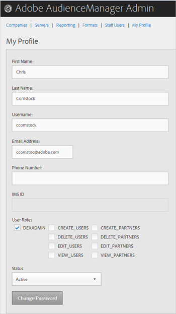
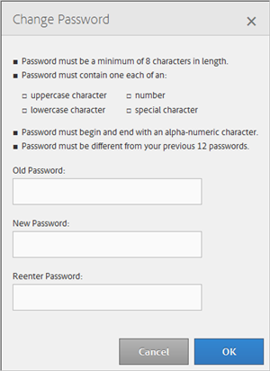

# Mijn profiel {#my-profile}

Bewerk de gegevens van het profiel Admin-beheer van Audience Manager of wijzig uw wachtwoord.

<!-- c_my_profile.xml -->

## Profiel bewerken {#edit-profile}

U kunt het profiel Admin-hulpprogramma van Audience Manager weergeven en bewerken, inclusief voornaam en achternaam, gebruikersnaam, e-mailadres, telefoonnummer, [!UICONTROL IMS ID]gebruikersrollen en status.

<!-- t_edit_profile.xml -->

1. Klik op **[!UICONTROL My Profile]**.

   

2. Vul de velden in:
   * **[!UICONTROL First Name]:**(Vereist) Geef uw voornaam op.
   * **[!UICONTROL Last Name]:**(Vereist) Geef uw achternaam op.
   * **[!UICONTROL Username]:**(Vereist) Geef uw voornaam op.
   * **[!UICONTROL Email Address]:**(Vereist) Geef uw e-mailadres op.
   * **[!UICONTROL Phone Number]:**Geef uw telefoonnummer op.
   * **[!UICONTROL IMS ID]:**Geef uw Internet Messaging Service-id op.
   * **[!UICONTROL User Roles]:**Selecteer de gewenste gebruikersrollen:
      * **[!UICONTROL DEXADMIN]:**Verleent beheerdertoegang om taken in het hulpmiddel van Admin van de Manager van de Publiek uit te voeren. Als u deze optie niet selecteert, kunt u afzonderlijke rollen kiezen. Deze rollen laten gebruikers taken uitvoeren gebruikend[!DNL API]vraag, maar niet in het hulpmiddel Admin.
      * **[!UICONTROL CREATE_USERS]:**Laat gebruikers nieuwe gebruikers tot stand brengen gebruikend een[!DNL API]vraag.
      * **[!UICONTROL DELETE_USERS]:**Laat gebruikers bestaande gebruikers schrappen gebruikend een[!DNL API]vraag.
      * **[!UICONTROL EDIT_USERS]:**Laat gebruikers bestaande gebruikers uitgeven gebruikend een[!DNL API]vraag.
      * **[!UICONTROL VIEW_USERS]:**Laat gebruikers andere gebruikers in uw configuratie van de Manager van de Publiek bekijken gebruikend een[!DNL API]vraag.
      * **[!UICONTROL CREATE_PARTNERS]:**Laat gebruikers de partners van de Manager van het Publiek tot stand brengen gebruikend een[!DNL API]vraag.
      * **[!UICONTROL DELETE_PARTNERS]:**Laat gebruikers de partners schrappen van de Manager van het Publiek gebruikend een[!DNL API]vraag.
      * **[!UICONTROL EDIT_PARTNERS]:**Laat gebruikers de partners van de Manager van de Publiek uitgeven gebruikend een[!DNL API]vraag.
      * **[!UICONTROL VIEW_PARNTERS]:**Laat gebruikers de partners van de Manager van de Auditie bekijken gebruikend een[!DNL API]vraag.
   * **[!UICONTROL Status]:**Selecteer de gewenste status:
      * **[!UICONTROL Active]:**Geeft op dat deze gebruiker in een actieve gebruiker van Audience Manager.
      * **[!UICONTROL Deactivated]:**Geeft aan dat deze gebruiker een gedeactiveerde gebruiker is in Audience Management.
      * **[!UICONTROL Expired]:**Geeft aan dat de account van deze gebruiker in Audience Manager is verlopen.
      * **[!UICONTROL Locked Out]:**Geeft aan dat het account van deze gebruiker in Audience Manager vergrendeld is.
3. Klik op **[!UICONTROL Submit]**.

## Wachtwoord wijzigen {#change-password}

Wijzig het wachtwoord voor Admin-beheer van publieksbeheer.

<!-- t_change_password.xml -->

1. Klik op **[!UICONTROL My Profile]**.
1. Klik op **[!UICONTROL Change Password]**.

   

   Het wachtwoord voor Audience Manager moet:

   * ten minste acht tekens lang;
   * Bevat ten minste één hoofdletter;
   * bevat ten minste één kleine letter;
   * ten minste één getal bevatten;
   * ten minste één speciaal teken bevatten;
   * Beginnen en eindigen met een alfanumeriek teken;
   * Begin en einde met een alfanumeriek teken.

1. Geef uw oude wachtwoord op.
1. Geef uw nieuwe wachtwoord op en bevestig het nieuwe wachtwoord.
1. Klik op **[!UICONTROL OK]**.