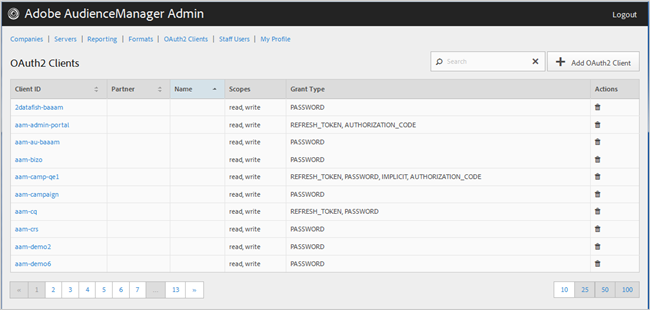

# OAuth2 Clients {#oauth-clients}

Gebruik de [!UICONTROL OAuth2 Clients] pagina om een lijst van [!UICONTROL OAuth2] cliënten in uw [!DNL Audience Manager] configuratie te bekijken. U kunt bestaande clients bewerken of verwijderen of nieuwe clients maken, op voorwaarde dat u de juiste gebruikersrollen hebt toegewezen.

## Overzicht {#overview}

<!-- c_oauth.xml -->

>[!NOTE]
>
>Zorg ervoor dat uw klant de [OAuth2](https://docs.adobe.com/content/help/en/audience-manager/user-guide/api-and-sdk-code/rest-apis/aam-api-getting-started.html#oauth) -documentatie in de [!DNL Handboek van de Manager van de Audience van de Audience leest.

[!DNL OAuth2] is een open norm voor vergunning om veilige gedelegeerde toegang tot [!DNL Audience Manager] middelen namens een middeleigenaar te verlenen.

U kunt elke kolom in stijgende of dalende orde sorteren door de gewenste kopbal van de kolom te klikken.

Gebruik het [!UICONTROL Search] vakje of de pagineringscontroles bij de bodem van de lijst om de gewenste cliënt te vinden.

## Een OAuth2-client maken of bewerken {#create-edit-client}

<!-- t_create_edit_auth.xml -->

Gebruik de [!UICONTROL OAuth2 Clients] pagina in het [!UICONTROL Admin] gereedschap Audience Manager om een nieuwe [!UICONTROL Oauth2] client te maken of om een bestaande client te bewerken.

1. Als u een nieuwe [!UICONTROL OAuth2] client wilt maken, klikt u op **[!UICONTROL OAuth2 Clients]** > **[!UICONTROL Add OAuth2 Client]**. Als u een bestaande [!UICONTROL OAuth2] client wilt bewerken, klikt u op de gewenste client in de **[!UICONTROL Client ID]** kolom.
1. Geef de gewenste naam voor deze [!UICONTROL OAuth2] client op. Dit is alleen een naam voor de record.
1. Geef het e-mailadres van de [!UICONTROL OAuth2] client op. Er geldt een limiet van één e-mailadres.
1. Van de **[!UICONTROL Partner]** drop-down lijst, selecteer de gewenste partner.
1. Geef in het **[!UICONTROL Client ID]** vak de gewenste id op. Dit is de waarde die wordt gebruikt bij het verzenden van [!DNL API] aanvragen. Het voorvoegsel wordt automatisch ingevuld wanneer u begint te typen nadat u een voorvoegsel in de [!UICONTROL Partner] vervolgkeuzelijst in de voorgaande stap hebt gekozen. De juiste notatie is &lt; *`partner subdomain`*> - &lt; *`Audience Manager username`*>.
1. Schakel het **[!UICONTROL Restrict to Partner Users]** selectievakje naar wens in of uit. Als deze controledoos wordt geselecteerd, moet de gebruiker een [!DNL Audience Manager] gebruiker zijn die voor de geselecteerde partner wordt vermeld. We raden u aan deze optie te selecteren.
1. Schakel in de **[!UICONTROL Scope]** sectie de selectievakjes **[!UICONTROL Read]** en **[!UICONTROL Write]** selectievakjes naar wens in of uit.
1. Selecteer in de **[!UICONTROL Grant Type]** sectie de gewenste toelatingsmiddelen. We raden u aan de standaardinstellingen van [!UICONTROL Password] en [!UICONTROL Refresh-token] opties te gebruiken.

   * **[!UICONTROL Implicit]**: Als u deze optie selecteert, wordt het [!UICONTROL Redirect URI] vak ingeschakeld. De gebruiker krijgt een automatisch toegangstoken nadat voor authentiek wordt verklaard en wordt onmiddellijk verzonden naar redirect [!DNL URI].
   * **[!UICONTROL Authorization Code]**: Als u deze optie selecteert, wordt het [!UICONTROL Redirect URI] vak ingeschakeld. De gebruiker wordt teruggegeven aan de cliënt na voor authentiek verklaard en dan verzonden naar redirect [!DNL URI].
   * **[!UICONTROL Password]**: De gebruiker wordt geverifieerd met een door de gebruiker ingevoerd wachtwoord en niet met een automatische validatiepoging via een verificatieserver.
   * **[!UICONTROL Refresh_token]**: Gebruikt om een verlopen toegangstoken voor een lange periode te verfrissen.

1. Geef in het **[!UICONTROL Redirect URI]** vak de gewenste waarde op [!DNL URI]. Deze optie wordt toegelaten slechts als u de **[!UICONTROL Implicit]** en **[!UICONTROL Authorization_code]** subsidietypes selecteert. In het **[!UICONTROL Redirect URI]** vak kunt u een door komma&#39;s gescheiden waarde van acceptabele [!DNL URI] waarden opgeven. Dit is de gebruiker [!DNL URI] van een cliënt wordt opnieuw gericht aan na het goedkeuren van de cliënt voor [!DNL API] toegang.
1. Geef de gewenste vervaltijd (in seconden) op voor toegang en vernieuw de vervaldatum van het token.

   * **[!UICONTROL Access Token Expiration Time]**: Het aantal seconden dat een toegangstoken na wordt uitgegeven geldig is. Kan null zijn als u de standaardinstelling van het platform wilt gebruiken (12 uur). Ook kan -1 zijn om erop te wijzen dat het toegangstoken niet verloopt.
   * **[!UICONTROL Refresh Token Expiration Time]**: Het aantal seconden dat een vernieuwingstoken geldig is nadat het wordt uitgegeven. Kan null zijn als u de standaardinstelling van het platform wilt gebruiken (30 dagen).

1. Klik op **[!UICONTROL Save]**.

Als u een [!UICONTROL OAuth2] client wilt verwijderen, klikt u op **[!UICONTROL OAuth2 Clients]** en klikt u vervolgens  in de **[!UICONTROL Actions]** kolom voor de gewenste client.

>[!MORELIKETHIS]
>
>* [API-vereisten en aanbevelingen](../admin-oauth2/aam-admin-api-requirements.md)

