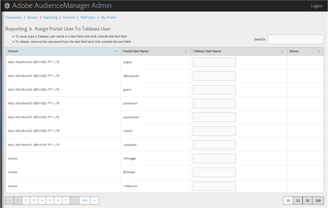

# Wijs een Poortgebruiker aan een Gebruiker van Tableau toe {#assign-a-portal-user-to-tableau-user}

<!-- t_tabeau.xml -->

Gebruik de [!UICONTROL Reporting] pagina om van een poortgebruiker een [!DNL Tableau] gebruiker. Hiermee kunnen gebruikers [!DNL Tableau] rapporten in Audience Manager.

1. Klik op **[!UICONTROL Reporting]** > **[!UICONTROL Assign Portal User to Tableau User]**.

   

1. Om een gebruiker, in de gewenste partnerrij toe te wijzen, typ a [!DNL Tableau] in het tekstveld en klik vervolgens buiten het tekstveld.

Als u een gebruikershandtekening wilt verwijderen, verwijdert u in de gewenste partnerrij de gebruikersnaam uit het tekstveld en klikt u vervolgens buiten het tekstveld.
