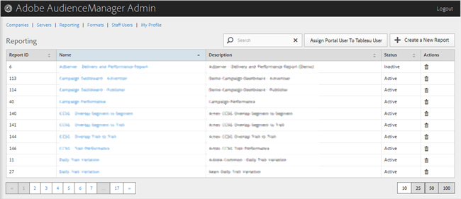

# Rapportage {#reporting}

U kunt rapporten van Audience Managers beheren door nieuwe rapporten te maken of bestaande rapporten te bewerken of te verwijderen. U kunt een poortgebruiker ook toewijzen als een [!DNL Tableau] gebruiker.

<!-- c_reporting.xml -->

U kunt elke kolom in stijgende of dalende orde sorteren door de gewenste kopbal van de kolom te klikken.

Gebruik de [!UICONTROL Search] of de pagineringscontroles bij de bodem van de lijst om het gewenste rapport te vinden.
