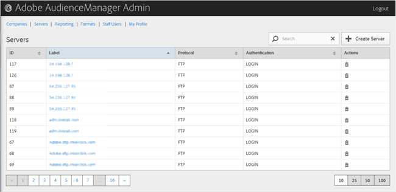

# Een server verwijderen {#delete-a-server}

Gebruik de [!UICONTROL Servers] pagina in het hulpmiddel Admin van de Manager van de Publiek om een bestaande server te schrappen.

<!-- t_delete_server.xml -->

>[!NOTE]
>
>U moet de [!UICONTROL DEXADMIN] rol hebben om bestaande servers te schrappen.

1. Als u een bestaande server wilt verwijderen, klikt u **[!UICONTROL Servers]** op.

   

1. Klik  in de **[!UICONTROL Actions]** kolom van de gewenste server.
1. Klik **[!UICONTROL OK]** om de verwijdering te bevestigen.
