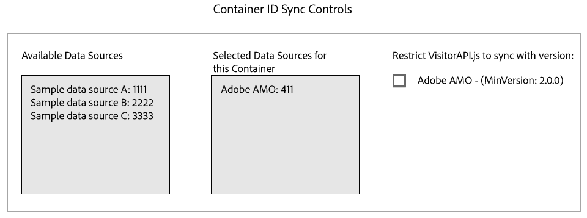

# Id&#39;s synchroniseren met Media Optimizer {#id-syncing-with-media-optimizer}

Standaard synchroniseren alle bedrijven gegevens met [!DNL Adobe Media Optimizer] ([!DNL AMO]). In [!UICONTROL Admin UI], heeft elke bedrijfcontainer een gegevensbron die dit proces beheert. Deze gegevensbron is [!UICONTROL Adobe AMO] ([!UICONTROL ID] 411). Klik op een containerrij (onder het [!UICONTROL Containers] tabblad) voor een geselecteerd bedrijf om deze standaardsynchronisatie uit te schakelen of om andere gegevensbronnen aan het [!DNL AMO] synchronisatieproces toe te voegen en te verwijderen.

## Synchronisatiestatus ID {#id-sync-status}

In de volgende tabel wordt de synchronisatiestatus van een gegevensbron beschreven.

| Status | Beschrijving |
|------ | -------- |
| Uit | Verwijder alle gegevensbronnen uit [!UICONTROL Selected Data Sources] deze container om id-synchrone versies uit te schakelen [!DNL AMO] |
| Aan (ongeacht versie van de ID-service) | Een gegevensbron synchroniseert met [!DNL AMO] ongeacht de de dienstversie van identiteitskaart wanneer: <ul><li>De gegevensbron wordt in de [!UICONTROL Selected Data Sources] lijst weergegeven.</li><li>Het [!DNL AMO] selectievakje *is niet* ingeschakeld.</li></ul> |
| Aan (ongeacht versie van de ID-service) | Een gegevensbron synchroniseert met [!DNL AMO] versie 2.0 (of hoger) van de ID-service wanneer: <ul><li>De gegevensbron wordt in de [!UICONTROL Selected Data Sources] lijst weergegeven.</li><li>Het [!DNL AMO] selectievakje *is* ingeschakeld.</li></ul> |

>[!MORELIKETHIS]
>
>* [Containers beheren](../companies/admin-manage-containers.md#task_61DB5CEECC5049DD8D059C642AC3F967)

