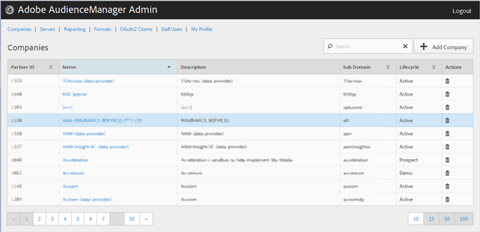

# Bedrijven {#companies}

Gebruik de [!UICONTROL Companies] pagina om een lijst van bedrijven in uw configuratie van de Audience Manager te bekijken. U kunt bestaande bedrijven uitgeven of schrappen of nieuwe bedrijven creëren, op voorwaarde dat u de aangewezen toegewezen gebruikersrollen hebt.

U kunt elke kolom in stijgende of dalende orde sorteren door de gewenste kopbal van de kolom te klikken.

Gebruik het [!UICONTROL Search] vakje of de pagineringscontroles bij de bodem van de lijst om het gewenste bedrijf te vinden.
