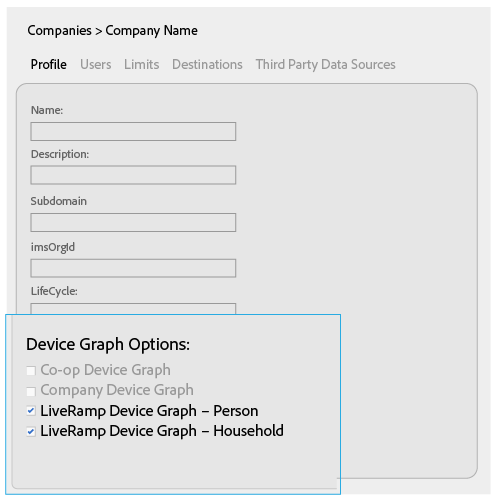
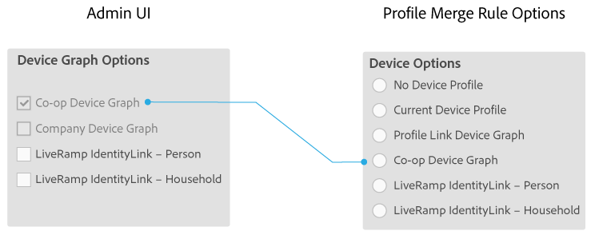
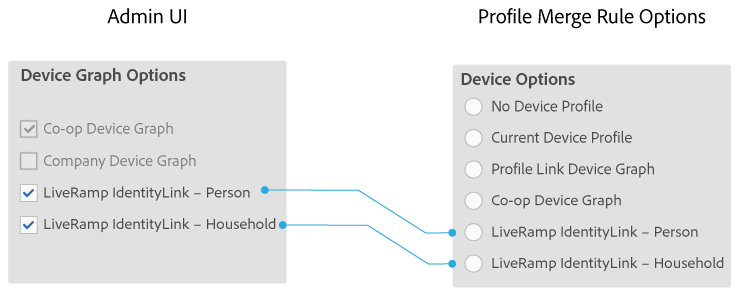

# Device graph-opties voor bedrijven {#device-graph-options-for-companies}

De [!UICONTROL Device Graph Options] zijn beschikbaar aan bedrijven die aan [!DNL Adobe Experience Cloud Device Co-op] deelnemen. Als een klant ook een contractuele relatie heeft met een externe provider van apparaatgrafieken die is geïntegreerd met Audience Manager, worden in deze sectie opties voor die apparaatgrafiek weergegeven. Deze opties bevinden zich in [!UICONTROL Companies] > bedrijfsnaam > [!UICONTROL Profile] > [!UICONTROL Device Graph Options].

In deze illustratie worden algemene namen gebruikt voor de grafiekopties van apparaten van derden. In productie, komen deze namen uit de leverancier van de apparatengrafiek en kunnen van wat variëren hier wordt getoond. De opties [!DNL LiveRamp] zijn bijvoorbeeld gewoonlijk (maar niet altijd):

* Beginnen met &quot;[!DNL LiveRamp]&quot;
* Bevat een variërende middelste naam
* Einde met &quot;[!UICONTROL - Household]&quot; of &quot;[!UICONTROL -Person]&quot;

## Apparaatgrafiekopties gedefinieerd {#device-graph-options-defined}

De grafiekopties van het apparaat die u hier selecteert, onthullen of verbergen de [!UICONTROL Device Options] keuzen waarover een [!DNL Audience Manager] klant beschikt wanneer deze een [!UICONTROL Profile Merge Rule] maakt.

### Afbeelding van apparaat voor coop {#co-op-graph}

Klanten die deelnemen aan de [Adobe Experience Cloud Device Co-op](https://experienceleague.adobe.com/docs/device-co-op/using/about/overview.html?lang=en) gebruiken deze opties om een [!UICONTROL Profile Merge Rule] te maken met [deterministische en probabilistische gegevens](https://experienceleague.adobe.com/docs/device-co-op/using/device-graph/links.html?lang=en). [!DNL Corporate Provisioning Team] activeert en desactiveert deze optie via een achterste - eind [!DNL API] vraag. U kunt deze vakjes in [!DNL Admin UI] niet controleren of ontruimen. De opties **[!UICONTROL Co-op Device Graph]** en **[!UICONTROL Company Device Graph]** sluiten elkaar ook uit. Klanten kunnen ons vragen het ene of het andere te activeren, maar niet beide. Als deze optie is ingeschakeld, wordt het besturingselement **[!UICONTROL Co-op Device Graph]** in de [!UICONTROL Device Options]-instellingen voor een [!UICONTROL Profile Merge Rule] weergegeven.

### Bedrijfsapparaatgrafiek {#company-graph}

Deze optie is bedoeld voor [!DNL Analytics]-klanten die de [!UICONTROL People]-norm in hun [!DNL Analytics]-rapportenpakket gebruiken. [!DNL Corporate Provisioning Team] activeert en desactiveert deze optie via een achterste - eind [!DNL API] vraag. U kunt deze vakjes in [!DNL Admin UI] niet controleren of ontruimen. De opties **[!UICONTROL Company Device Graph]** en **[!UICONTROL Co-op Device Graph]** sluiten elkaar ook uit. Klanten kunnen ons vragen het ene of het andere te activeren, maar niet beide. Indien ingeschakeld:

* Deze apparatengrafiek gebruikt deterministische gegevens die tot het bedrijf behoren u (geen probabilistische gegevens) vormt.
* [!DNL Audience Manager] leidt automatisch tot een  [!UICONTROL Data Source] geroepen  `*`partnernaam`*-Company Device Graph-Person`. In [!UICONTROL Data Source] detailspagina, [!DNL Audience Manager] kunnen klanten de partnernaam, beschrijving veranderen, en [Controles van de Uitvoer van Gegevens ](https://experienceleague.adobe.com/docs/device-co-op/using/device-graph/links.html?lang=en) op deze gegevensbron toepassen.
* [!DNL Audience Manager] klanten  *zien* geen nieuwe instelling in de  [!UICONTROL Device Options] sectie voor een  [!UICONTROL Profile Merge Rule].

### Grafiek LiveRamp-apparaat (persoonlijk of in het huishouden) {#liveramp-device-graph}

Deze selectievakjes worden ingeschakeld in [!DNL Admin UI] wanneer een partner een [!UICONTROL Data Source] maakt en **[!UICONTROL Use as an Authenticated Profile]** en/of **[!UICONTROL Use as a Device Graph]** selecteert. De namen voor deze instellingen worden bepaald door de externe provider van apparaatgrafieken (bijvoorbeeld [!DNL LiveRamp], [!DNL TapAd] enz.). Als deze optie is ingeschakeld, betekent dit dat het bedrijf dat u configureert, gegevens zal gebruiken die door deze apparaatgrafieken worden verschaft.

>[!MORELIKETHIS]
>
>* [Definities van opties voor regels voor profielsamenvoeging](https://experienceleague.adobe.com/docs/audience-manager/user-guide/features/profile-merge-rules/merge-rule-definitions.html?lang=en).
>* [Instellingen gegevensbron en menuopties](https://experienceleague.adobe.com/docs/audience-manager/user-guide/features/data-sources/datasources-list-and-settings.html?lang=en)

