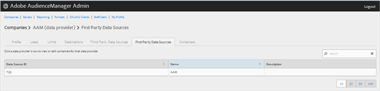
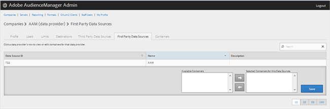

# Directe dataproviders beheren {#manage-first-party-data-providers}

Bekijk of geef containers en afbeeldingen voor de leveranciers van gegevens van de eerste partij uit.

<!-- t_first_party_providers.xml -->

1. Klikken **[!UICONTROL Companies]** en klik vervolgens op het gewenste bedrijf om het [!UICONTROL Profile] pagina. Gebruik de [!UICONTROL Search] of de pagineringscontroles bij de bodem van de lijst om het gewenste bedrijf te vinden. U kunt elke kolom in stijgende of dalende orde sorteren door de gewenste kopbal van de kolom te klikken.

1. Klik op de knop **[!UICONTROL First Party Data Providers]** tab.

   

1. Klik op de rij van een gegevensaanbieder om containers en toewijzingen voor die gegevensaanbieder weer te geven of te bewerken.

   

1. Containers verplaatsen vanuit de **[!UICONTROL Available Containers]** en **[!UICONTROL Selected Containers for This Data Provider]** lijsten door de gewenste containers te selecteren en vervolgens naar rechts of links te klikken.
1. Klikken **[!UICONTROL Save]** als u wijzigingen hebt aangebracht.
