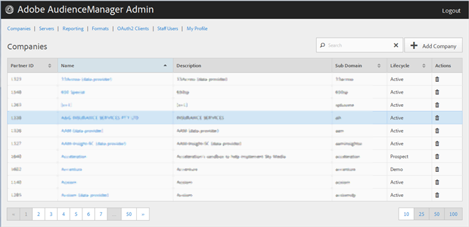

# Een bedrijfsprofiel maken {#create-a-company-profile}

Gebruik de [!UICONTROL Companies] pagina in het hulpmiddel Admin van de Manager van de Publiek om een nieuw bedrijf tot stand te brengen.

<!-- t_create_company.xml -->

>[!NOTE]
>
>U moet de **[!UICONTROL DEXADMIN]** rol hebben om nieuwe bedrijven te creëren.

1. Klik op **[!UICONTROL Companies]** > **[!UICONTROL Add Company]**.
1. Vul de velden in:

   * **[!UICONTROL Name]**: (Vereist) Geef de naam van de onderneming op.
   * **[!UICONTROL Description]**: (Vereist) Geef beschrijvende informatie over de onderneming, zoals de industrie of haar volledige naam.
   * **[!UICONTROL Subdomain]**: (Vereist) Geef het subdomein van het bedrijf op. De tekst die u invoert, wordt weergegeven als het subdomein van de gebeurtenisaanroep. Dit kan niet worden gewijzigd. Het moet een tekenreeks van [!DNL URL]geldige tekens zijn.

      Bijvoorbeeld, als uw bedrijf werd genoemd [!DNL AcmeCorp], zou subdomain zijn [!DNL acmecorp].

      Audience Manager gebruikt het subdomein voor [!UICONTROL Data Collection Server]([!UICONTROL DCS]). In het vorige voorbeeld, als uw bedrijf volledig [!DNL URL] binnen [!UICONTROL DCS] zou zijn [!DNL acmecorp.demdex.net].

   * **[!UICONTROL Lifecyle]**: Geef het gewenste werkgebied voor het bedrijf op:
      * **[!UICONTROL Active]**: Specificeer dat het bedrijf een actieve cliënt van de Manager van het Publiek zal zijn. Een [!UICONTROL Active] rekening betekent een betalende klant, niet alleen voor raadpleging, maar voor de Manager van het publiek SKU.
      * **[!UICONTROL Demo]**: Geef op dat het bedrijf alleen voor demo-doeleinden zal worden gebruikt. Gegevens worden automatisch gerapporteerd.
      * **[!UICONTROL Prospect]**: Specificeer dat het bedrijf een potentiële cliënt van de Manager van de Audience, zoals een bedrijf is dat een vrije [!DNL POC] of een rekeningsopstelling voor een verkoopdemo wordt gegeven.
      * **[!UICONTROL Test]**: Geef op dat het bedrijf alleen voor interne tests wordt gebruikt.
   * **[!UICONTROL Account Types]**: Geef de volledige set accounttypen voor dit bedrijf op. Geen accounttype sluit elkaar uit met een ander type.
      * **[!UICONTROL Full AAM]**: Geef op dat het bedrijf een volledige Adobe Audience Manager-account heeft en dat gebruikers toegang tot de aanmelding hebben.
      * **[!UICONTROL MMP]**: Specificeer dat het bedrijf is toegelaten om de [!UICONTROL Master Marketing Profile] ([!UICONTROL MMP]) mogelijkheden te gebruiken. Met deze optie [!UICONTROL MMP] kan het publiek in de Experience Cloud worden gedeeld met een [!UICONTROL Experience Cloud ID] ([!DNL MCID]) die aan elke bezoeker is toegewezen en vervolgens wordt gebruikt door Audience Manager. Als u dit accounttype selecteert, [!UICONTROL Experience Cloud ID Service] wordt de account automatisch geselecteerd.

         Voor meer informatie, zie de Diensten van het [Soorten publiek - HoofdMarketing Profiel](https://marketing.adobe.com/resources/help/en_US/mcloud/audience_library.html).
   * **[!UICONTROL Data Source]**: Geef op dat het bedrijf een gegevensaanbieder van derden is in Audience Manager.
   * **[!UICONTROL Targeting Partner]**: Specificeer dat het bedrijf als gericht platform voor de klanten van de Manager van de Publiek dienst doet.
   * **[!UICONTROL Visitor ID Service]**: Geef op dat het bedrijf de [!UICONTROL Experience Cloud Visitor ID Service]functie mag gebruiken.

      Het [!UICONTROL Experience Cloud Visitor ID Service] biedt een universele bezoekersidentiteitskaart voor de oplossingen van de Wolk van de Ervaring. Raadpleeg de gebruikershandleiding [van de](https://marketing.adobe.com/resources/help/en_US/mcvid/mcvid-overview.html)Experience Cloud Visitor ID Service voor meer informatie.

   * **[!UICONTROL Agency]**: Geef op dat het bedrijf een [!UICONTROL Agency] account krijgt.

1. Klik op **[!UICONTROL Create]**. Ga met de instructies in [geef een Profiel](../companies/admin-manage-company-profiles.md#edit-company-profile)van het Bedrijf uit.

   

## Een bedrijfsprofiel bewerken {#edit-company-profile}

Bewerk het profiel van een bedrijf, inclusief de naam, beschrijving, subdomein, levenscyclus en meer.

<!-- t_edit_company_profile.xml -->

1. Klik **[!UICONTROL Companies]**, bepaal de plaats en klik het gewenste bedrijf om zijn [!UICONTROL Profile] pagina te tonen.

   Gebruik het [!UICONTROL Search] vakje of de pagineringscontroles bij de bodem van de lijst om het gewenste bedrijf te vinden. U kunt elke kolom in stijgende of dalende orde sorteren door de gewenste kopbal van de kolom te klikken.

   

1. Bewerk indien nodig de velden:

   * **[!UICONTROL Name]**: Bewerk de naam van het bedrijf. Dit is een verplicht veld.
   * **[!UICONTROL Description]**: Bewerk de beschrijving van het bedrijf. Dit is een verplicht veld.
   * **[!UICONTROL Subdomain]**: (Vereist) Geef het subdomein van het bedrijf op. De tekst die u invoert, wordt weergegeven als het subdomein van de gebeurtenisaanroep. Dit kan niet worden gewijzigd. Het moet een tekenreeks van [!DNL URL]geldige tekens zijn.

      Bijvoorbeeld, als uw bedrijf werd genoemd [!DNL AcmeCorp], zou subdomain zijn [!DNL acmecorp].

      Audience Manager gebruikt het subdomein voor [!UICONTROL Data Collection Server] ([!UICONTROL DCS]). In het vorige voorbeeld, als uw bedrijf volledig [!DNL URL] binnen [!UICONTROL DCS] zou zijn [!DNL acmecorp.demdex.net].

   * **[!UICONTROL imsOrgld]**: ([!UICONTROL Identity Management System Organization ID]) Met deze id kunt u verbinding maken met uw bedrijf met de Adobe Experience Cloud.
   * **[!UICONTROL Lifecyle]**: Geef het gewenste werkgebied voor het bedrijf op:
      * **[!UICONTROL Active]**: Specificeer dat het bedrijf een actieve cliënt van de Manager van het Publiek zal zijn. Een actieve account betekent een betalende klant, niet alleen voor advies, maar ook voor de SKU van Audience Manager.
      * **[!UICONTROL Demo]**: Geef op dat het bedrijf alleen voor demo-doeleinden zal worden gebruikt. Gegevens worden automatisch gerapporteerd.
      * **[!UICONTROL Prospect]**: Specificeer dat het bedrijf een potentiële cliënt van de Manager van de Audience, zoals een bedrijf is dat een vrije [!DNL POC] of een rekeningsopstelling voor een verkoopdemo wordt gegeven.
      * **[!UICONTROL Test]**: Geef op dat het bedrijf alleen voor interne tests wordt gebruikt.
   * **[!UICONTROL Account Types]**: Geef de volledige set accounttypen voor dit bedrijf op. Geen accounttype sluit elkaar uit met een ander type.
      * **[!UICONTROL Full AAM]**: Geef op dat het bedrijf een volledige Adobe Audience Manager-account heeft en dat gebruikers toegang tot de aanmelding hebben.
      * **[!UICONTROL MMP]**: Geef op dat het bedrijf de mogelijkheden van het Master Marketing Profile ([!UICONTROL MMP]) mag gebruiken.

         Als u dit accounttype selecteert, **[!UICONTROL Visitor ID Service]** wordt dit ook automatisch geselecteerd.
Voor meer informatie, zie de Diensten van het [Soorten publiek - HoofdMarketing Profiel](https://marketing.adobe.com/resources/help/en_US/mcloud/audience_library.html).
   * **[!UICONTROL Data Source]**: Geef op dat het bedrijf een gegevensaanbieder van derden is in Audience Manager.
   * **[!UICONTROL Targeting Partner]**: Specificeer dat het bedrijf als gericht platform voor de klanten van de Manager van de Publiek dienst doet.
   * **[!UICONTROL Visitor ID Service]**: Geef op dat het bedrijf de Experience Cloud Visitor ID Service mag gebruiken.

      De Experience Cloud Visitor ID-service biedt een universele bezoekersidentiteitskaart voor alle Experience Cloud-oplossingen. Raadpleeg de gebruikershandleiding [van de](https://microsite.omniture.com/t2/help/en_US/mcvid/mcvid_service.html)Experience Cloud Visitor ID Service voor meer informatie.

   * **[!UICONTROL Agency]**: Geef op dat de onderneming een account van het Agentschap heeft.
   * **[!UICONTROL Features]**: Selecteer de gewenste opties:
      * **[!UICONTROL Password Expiration]**: Plaatst alle gebruikerswachtwoorden binnen dit bedrijf om na 90 dagen te verlopen om de veiligheid van de Manager van de Publiek te verhogen.
      * **[!UICONTROL Reporting]**: Hiermee schakelt u de rapportage van Audience Manager voor dit bedrijf in.
      * **[!UICONTROL Role Based Access Controls]**: Schakel op rol gebaseerde toegangsbesturingselementen voor dit bedrijf in. Op rol-gebaseerde toegangscontroles laten u gebruikersgroepen met verschillende toegangstoestemmingen tot stand brengen. De individuele gebruikers binnen deze groepen kunnen tot slechts specifieke eigenschappen in de Manager van het Publiek dan toegang hebben.

1. Klik op **[!UICONTROL Submit Updates]**.

## Een bedrijfsprofiel verwijderen {#delete-company-profile}

Gebruik de [!UICONTROL Companies] pagina in het hulpmiddel van de Manager van de Publiek [!UICONTROL Admin] om een bestaand bedrijf te schrappen.

<!-- t_delete_company.xml -->

>[!NOTE]
>
>U moet de [!UICONTROL DEXADMIN] rol hebben om bestaande bedrijven te schrappen.

1. Als u een bestaand bedrijf wilt verwijderen, klikt u op **[!UICONTROL Companies]**.

   

1. Klik  in de **[!UICONTROL Actions]** kolom van het gewenste bedrijf.
1. Klik **[!UICONTROL OK]** om de verwijdering te bevestigen.
