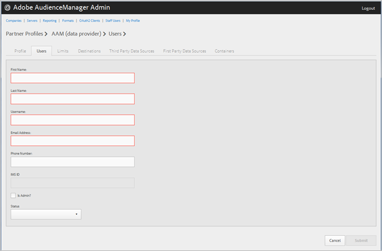

# Bedrijfsgebruikers beheren {#manage-company-users}

Maak nieuwe Audience Managers of bewerk en verwijder bestaande gebruikers.

<!-- t_manage_company_users.xml -->

1. Klik **[!UICONTROL Companies]**, dan bepaal de plaats en klik het gewenste bedrijf om zijn [!UICONTROL Profile] pagina te tonen.

   Gebruik de doos [!UICONTROL Search] of de pagineringscontroles bij de bodem van de lijst om het gewenste bedrijf te vinden. U kunt elke kolom in stijgende of dalende orde sorteren door de gewenste kopbal van de kolom te klikken.
1. Klik op het tabblad **[!UICONTROL Users]**.
1. Als u een nieuwe gebruiker wilt maken, klikt u op **[!UICONTROL Create a New User]**. Als u een bestaande gebruiker wilt bewerken, zoekt en klikt u op de gewenste gebruiker in de kolom **[!UICONTROL Username]**.

   

1. Vul de velden in:

   * **[!UICONTROL First Name]**: (Vereist) Geef de voornaam van de gebruiker op.
   * **[!UICONTROL Last Name]**: (Vereist) Geef de achternaam van de gebruiker op.
   * **[!UICONTROL Username]**: (Vereist) Geef de gebruikersnaam van de Audience Manager van de gebruiker op. Gebruikersnamen moeten uniek zijn.
   * **[!UICONTROL Email Address]**: (Vereist) Geef het e-mailadres van de gebruiker op.
   * **[!UICONTROL Phone Number]**: Geef het telefoonnummer van de gebruiker op.
   * **[!UICONTROL IMS ID]**: De gebruiker  [!UICONTROL Identity Management System ID]. Met deze id kan de gebruiker een koppeling maken naar Adobe-oplossingen voor de Adobe Experience Cloud.
   * **[!UICONTROL Is Admin]**: Van deze gebruiker een gebruiker met beheerdersrechten voor Audience Managers maken. Een beheerder heeft alle gebruikersrollen van de Audience Manager voor deze partner.
   * **[!UICONTROL Status]**: Wanneer u een nieuwe gebruiker maakt, wordt dit veld eerst weergegeven  **[!UICONTROL Pending]** totdat de gebruiker zich aanmeldt en het tijdelijke wachtwoord opnieuw instelt. Als u een bestaande gebruiker bewerkt, kunt u uit de volgende statussen kiezen:
      * **[!UICONTROL Active]**: Geeft aan dat deze gebruiker een actieve gebruiker van de Audience Manager is.
      * **[!UICONTROL Deactivated]**: Geeft aan dat deze gebruiker een gedeactiveerde gebruiker van een Audience Manager is.
      * **[!UICONTROL Expired]**: Geeft aan dat deze gebruiker een verlopen gebruiker is.
      * **[!UICONTROL Locked Out]**: Geeft aan dat deze gebruiker een vergrendelde gebruiker is.

1. Klik op **[!UICONTROL Submit]**.

## Een gebruiker {#delete-user} verwijderen

Een gebruiker verwijderen:

1. Klik **[!UICONTROL Companies]**, bepaal de plaats en klik het gewenste bedrijf, dan klik **[!UICONTROL Users]** tabel.
1. Klik  in **[!UICONTROL Actions]** kolom van de gewenste gebruiker.
1. Klik **[!UICONTROL OK]** om de schrapping te bevestigen.