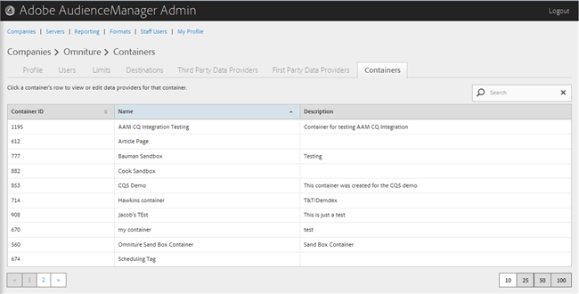
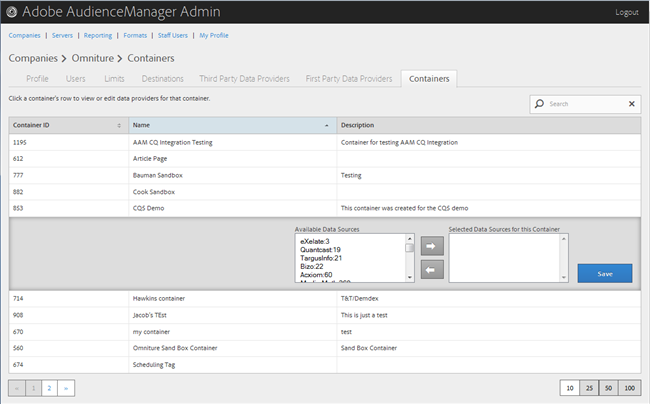

# Containers beheren {#manage-containers}

Gegevensproviders voor containers weergeven of bewerken.

<!-- t_containers.xml -->

>[!NOTE]
>
>Standaard worden bedrijven gemaakt met één container. In de gebruikersinterface kunt u meer containers voor een bedrijf maken, in **[!UICONTROL Tools > Tags]**.

1. Klik **[!UICONTROL Companies]**, bepaal de plaats en klik het gewenste bedrijf om zijn [!UICONTROL Profile] pagina te tonen.

   Gebruik het [!UICONTROL Search] vakje of de pagineringscontroles bij de bodem van de lijst om het gewenste bedrijf te vinden. U kunt elke kolom in stijgende of dalende orde sorteren door de gewenste kopbal van de kolom te klikken.

1. Klik op het **[!UICONTROL Containers]** tabblad.

   

1. Klik op de rij van een container om gegevensproviders voor die container weer te geven of te bewerken.

   

1. Verplaats gegevensbronnen uit de lijst **[!UICONTROL Available Data Sources]** **[!UICONTROL Selected Data Sources for This Container]** en de lijst door de gewenste gegevensbronnen te selecteren en klik vervolgens zo nodig op de pijl naar rechts of naar links.

   U kunt deze taak ook uitvoeren vanuit de [Data](../companies/admin-third-party-providers.md#task_E942DD674D794BA6B8EFD52FD866E689)Providerspage van derden.

1. Klik **[!UICONTROL Save]** als u wijzigingen hebt aangebracht.

>[!MORELIKETHIS]
>
>* [Id&#39;s synchroniseren met Media Optimizer](../companies/admin-amo-sync.md#concept_2B5537233DAA4860B3503B344F937D83)

