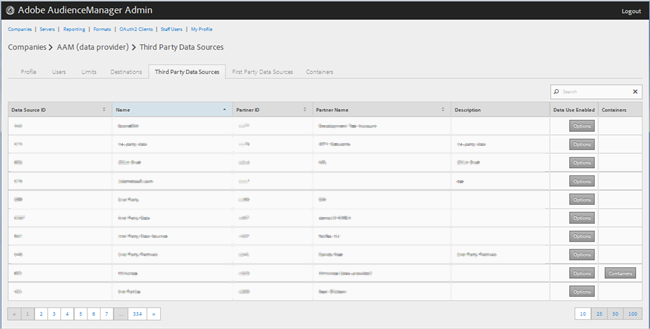
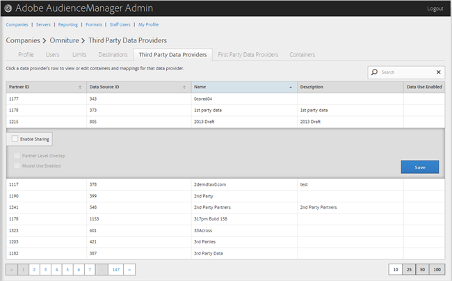

# Externe dataproviders beheren {#manage-third-party-data-providers}

Containers en toewijzingen voor externe gegevensproviders weergeven of bewerken. U kunt het delen met verschillende gegevensleveranciers ook toelaten.

1. Klikken **[!UICONTROL Companies]** en klik vervolgens op het gewenste bedrijf om het [!UICONTROL Profile] pagina.

   Gebruik de [!UICONTROL Search] of de pagineringscontroles bij de bodem van de lijst om het gewenste bedrijf te vinden. U kunt elke kolom in stijgende of dalende orde sorteren door de gewenste kopbal van de kolom te klikken.
1. Klik op de knop **[!UICONTROL Third Party Data Providers]** tab.

   

1. Klik op de rij van een gegevensaanbieder om containers en toewijzingen voor die gegevensaanbieder weer te geven of te bewerken.

   

1. Selecteren **[!UICONTROL Enable Sharing]** om de volgende opties in te schakelen:

   * **Overlappen op partnerniveau:**
   * **Model Use Enabled:** Laat dit bedrijf deze gegevensleverancier gebruiken wanneer het creëren van algoritmische modellen.

   Wanneer u delen inschakelt, krijgt u toegang tot kenmerken van deze gegevensaanbieder.

1. (Voorwaardelijk) Als de container voor deze provider is ingeschakeld, kunt u containers voor deze gegevensaanbieder selecteren door de gewenste containers van de beschikbare lijst naar de geselecteerde lijst te verplaatsen.

   U kunt deze taak ook uitvoeren vanuit de [Containers](../companies/admin-manage-containers.md#task_61DB5CEECC5049DD8D059C642AC3F967) pagina.
1. Klikken **[!UICONTROL Save]** als u wijzigingen hebt aangebracht.
