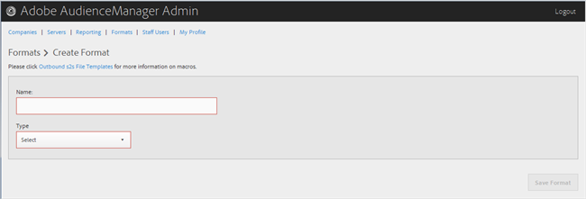

# Een indeling maken of bewerken {#create-or-edit-a-format}

Gebruik de pagina [!UICONTROL Formats] in het hulpmiddel van Admin van de Audience Manager om een nieuw formaat tot stand te brengen of een bestaand formaat uit te geven.

<!-- t_create_format.xml -->

>[!TIP]
>
>Wanneer u een indeling voor de buitenste gegevens selecteert, kunt u het beste indien mogelijk een bestaande indeling opnieuw gebruiken. Het gebruiken van reeds-bewezen formaat zorgt ervoor dat uw uitgaande gegevens met succes zullen worden geproduceerd. Als u precies wilt zien hoe een bestaande indeling wordt opgemaakt, klikt u op de optie [!UICONTROL Formats] in de menubalk en zoekt u de indeling op naam of op id-nummer. Onjuiste indelingen of macro&#39;s die in indelingen worden gebruikt, zorgen voor een verkeerde indeling of verhinderen dat informatie volledig wordt uitgevoerd.

1. Als u een nieuwe indeling wilt maken, klikt u op **[!UICONTROL Formats]** > **[!UICONTROL Add Format]**. Als u een bestaande indeling wilt bewerken, klikt u op de gewenste indeling in de kolom **[!UICONTROL Name]**.

   

1. Vul de velden in:
   * **Naam:** (Vereist) Geef een beschrijvende naam op voor de indeling.
   * **Type:** (Vereist) Selecteer de gewenste indeling:
      * **[!UICONTROL File]**: Hiermee verzendt u gegevens via  [!DNL FTP] bestanden.
      * **[!UICONTROL HTTP]**: Omsluit gegevens in een  [!DNL JSON] omslag.

1. (Voorwaardelijk) Als u **[!UICONTROL File]** koos, vul de gebieden in:

   >[!NOTE]
   >
   >Zie [Bestandsindelingmacro&#39;s](../formats/file-formats.md#concept_A867101505074418A58DE325949E5089) en [HTTP-indelingsmacro&#39;s](../formats/web-formats.md#reference_C392124A5F3F42E49F8AADDBA601ADFE) voor een lijst met beschikbare macro&#39;s.

   * **[!UICONTROL File Name]:** Geef de bestandsnaam op voor het bestand voor gegevensoverdracht.
   * **Koptekst:** geef de tekst op die in de eerste rij van het bestand voor gegevensoverdracht wordt weergegeven.
   * **[!UICONTROL Data Row]:** Geef de tekst op die in elke buitenste rij van het bestand wordt weergegeven.
   * **[!UICONTROL Maximum File Size (In MB)]:** Geef de maximale bestandsgrootte op voor bestanden voor gegevensoverdracht. Gecomprimeerde bestanden moeten kleiner zijn dan 100 MB. De ongecomprimeerde bestandsgrootte is niet beperkt.
   * **[!UICONTROL Compression]:** Selecteer het gewenste compressietype: gz of zip voor uw gegevensbestanden. Voor levering aan [!UICONTROL AWS S3], moet u .gz of uncompressed dossiers gebruiken.
   * **[!UICONTROL .info Receipt]:** Geeft op dat er een bestand met overdrachtsbesturingselementen ([!DNL .info]) wordt gegenereerd. Het [!DNL .info] dossier verstrekt meta-gegevensinformatie over dossieroverdrachten zodat de partners kunnen verifiëren dat de Audience Manager correct behandelde dossieroverdrachten. Voor meer informatie, zie [Overdracht-Controle Dossiers voor de Overdrachten van het Dossier van het Logboek](https://experienceleague.adobe.com/docs/audience-manager/user-guide/implementation-integration-guides/receiving-audience-data/batch-outbound-data-transfers/transfer-control-files.html?lang=en).
   * **[!UICONTROL MD5 Checksum Receipt]:** Specificeert dat een  [!DNL MD5] checksum ontvangstbewijs wordt geproduceerd. Het [!DNL MD5] controlesomontvangstbewijs zodat de partners kunnen verifiëren dat de Audience Manager de volledige overdracht correct behandelde.

1. (Voorwaardelijk) Als u **[!UICONTROL HTTP]** koos, vul de gebieden in:

   * **[!UICONTROL Method]:** Kies de  [!DNL API] methode die u voor het overdrachtsproces wilt gebruiken:
      * **[!UICONTROL POST]:** Als u selecteert  [!DNL POST], selecteer het inhoudstype ([!DNL XML] of  [!DNL JSON]), dan specificeer de verzoeklichaam.
      * **[!UICONTROL GET]:** Als u selecteert  [!DNL GET], specificeer de vraagparameters.

1. Klik **[!UICONTROL Create]** als u een nieuw formaat creeert, of **[!UICONTROL Save Updates]** als u een bestaand formaat uitgeeft.

## Een indeling verwijderen {#delete-format}

1. Klik op **[!UICONTROL Formats]**.
2. Klik  in **[!UICONTROL Actions]** kolom van het gewenste formaat.
3. Klik **[!UICONTROL OK]** om de schrapping te bevestigen.
