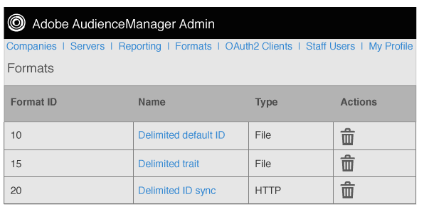

# Overzicht van indelingen {#formats-overview}

Een indeling is een opgeslagen sjabloon (of bestand) waarin macro&#39;s worden gebruikt om de inhoud te ordenen van gegevens die naar een doel worden verzonden. Indelingstypen zijn inclusief [!DNL HTTP] indelingen en bestandsindelingen. [!DNL HTTP] indelingen verzenden gegevens in een [!DNL JSON] object met een [!DNL POST] of [!DNL GET] methode. Met bestandsindelingen worden gegevens in een bestand verzonden door [!DNL FTP]. Met de macro&#39;s die door elke indeling worden gebruikt, kunt u bestandsnamen instellen, bestandsheaders definiëren en de inhoud van een gegevensbestand ordenen. In de beheerder [!DNL UI]kunt u bij het instellen van doelen voor klanten indelingen maken, opslaan en hergebruiken.

